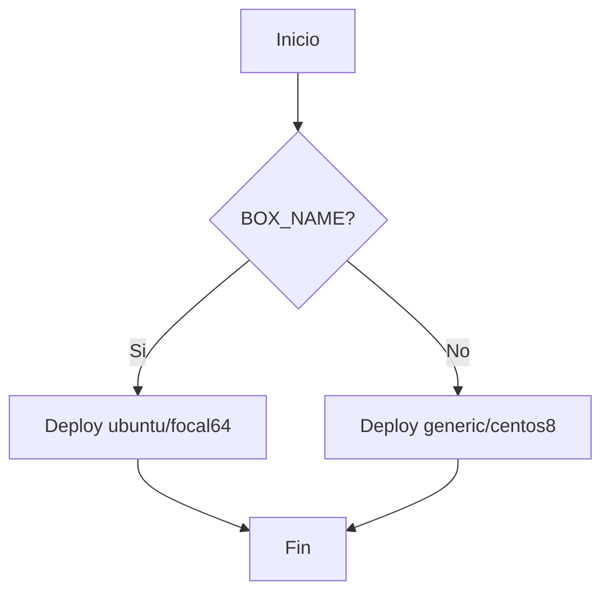

# Despliegue de Wordpress usando Vagrant y Chef

El Objetivo de este proyecto es desplegar Wondpress usando Vagrant y Chef.

## IP's

- Se espera que la red de las VMs sea 192.168.56.0/24. Si VirtualBox tiene otro rango de red entonces se debe ajustar el archivio `.env` con los valores adecuados.

## Pre-requisitos

- Se ha trabajado sobre Windows
- Necesitamos tener instalado Git: descargar e instalar Git desde https://git-scm.com
- Vagrant 2.3.7 o superior: Descarga el instalador de Vagrant desde el sitio web oficial de [Vagrant](https://www.vagrantup.com).
- Necesitas tener instalado VirtualBox 7.0 o superior (https://www.virtualbox.org)
- Ruby 2.5 o superior : Descarga el instalador de RubyInstaller desde el sitio web oficial de[RubyInstaller](https://rubyinstaller.org).
- Instala el plugin `vagrant-env` para poder cargar variables ed ambiente desde el archivo `.env`
```bash
 vagrant plugin install vagrant-env
```
- También debes instalar la gema `serverspec` para poder ejecutar las pruebas de integración e infraestructura:

```bash
 gem install serverspec
```

## Arquitectura

El proyecto se compone de tres servicios, cada uno deployado en una VM individual:

- [database](cookbooks/database/README.md): En esta VM se instala MySQL.
- [wordpress](cookbooks/wordpress/README.md): En esta VM se instala el servidor web Apache y la aplicación Wordpress es instalada para ser servida por el servidor web.
- [proxy](cookbooks/proxy/README.md): Em esta VM se instala un proxy Nginx el cual será el punto de entrada a la aplicación.


## Configuración previa

En el archivo `.env` se definen valores como las IPs de las VMs, el usuario y password de la BD que se usará para configurar Wordpress.

Antes de levantar Vagrant se define la caja que se usará. Mira el siguiente diagrama:



## Iniciar las VM

Para levantar las dos máquinas virtuales con Ubuntu 20.04 ejecuta el comando:

```bash
 vagrant up
```

Para levantar las dos máquinas virtuales con CentOS 8 ejecuta el comando:

```bash
 BOX_NAME="generic/centos8" vagrant up
```

Se van a crear dos máquinas virtuales, una llamada `wordpress` y otra llamada `database`.

## Wordpress

Una vez que se hayan levantado todas las VMs podrás acceder a Wordpress en la página: http://192.168.56.2/


## Unit tests

Para ejecutar las pruebas unitarias usa el script `tests.sp1` alojado en la carpeta UniTest, estamos sobre windows, usando PowerShell.

```bash
 UnitTest/tests.sp1
 Seleccione una opción:
 1. UnitTest en Máquina Virtual (VM)
 2. UnitTest en Docker
 3. UnitTest de integración e infraestructura
 4. Exit
 Opción: 
```

Si seleccionas 1 se ejecutará una VM usando Vagrant y ejecutará las pruebas unitarias.
Si seleccionamos 3 se corren las pruebas de integración e infraestructura.

## Pruebas de integración e infraestructura

Para ejecutar todas las pruebas de integración usa el script `tests.s1` opción 3:

```bash
 UnitTest/tests.sh
 Seleccione una opción:
 1. UnitTest en Máquina Virtual (VM)
 2. UnitTest en Docker
 3. UnitTest de integración e infraestructura
 4. Exit
 Opción: 
```

Si deseas ejecutar una a una las pruebas de integración e infraestructura entonces envíale el nombre de la receta al script `tests.sp1`:

```bash
 # UnitTest base de datos (DB)
 UnitTest/tests.sp1 database

 # UnitTest Wordpress
 UnitTest/tests.sp1 wordpress

# UnitTest proxy
 UnitTest/tests.sp1 proxy
```

# Reference:
- Chef Documentation: https://docs.chef.io/
- ChefSpec: https://docs.chef.io/workstation/chefspec/
- ServerSpec: https://serverspec.org/resource_types.html
- Test Kitchen: https://docs.chef.io/workstation/kitchen/
